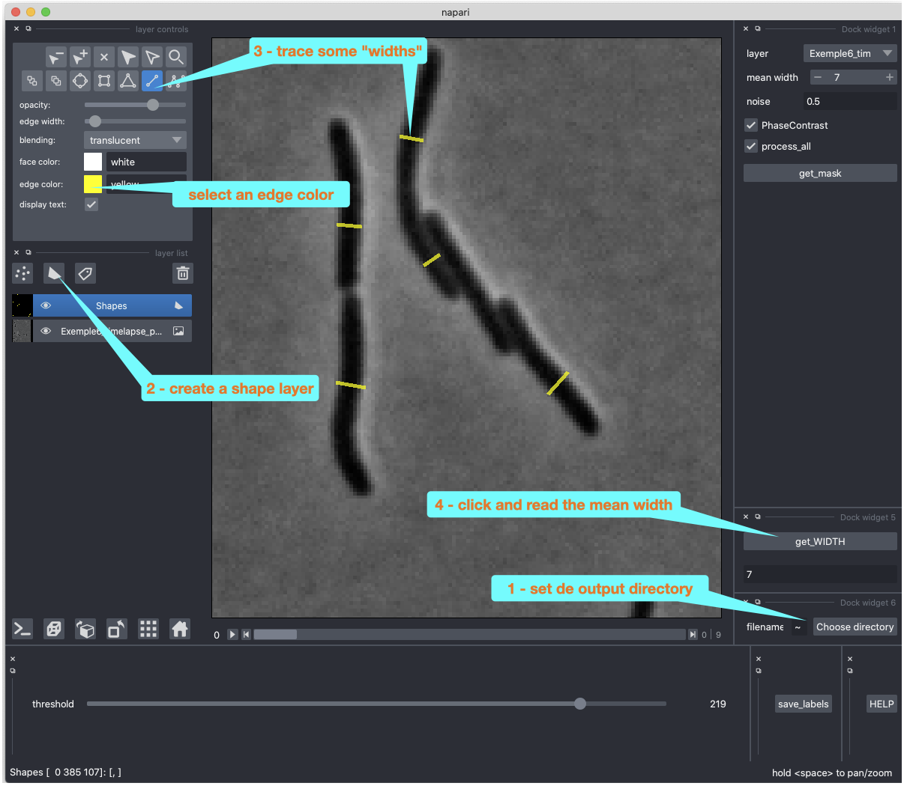
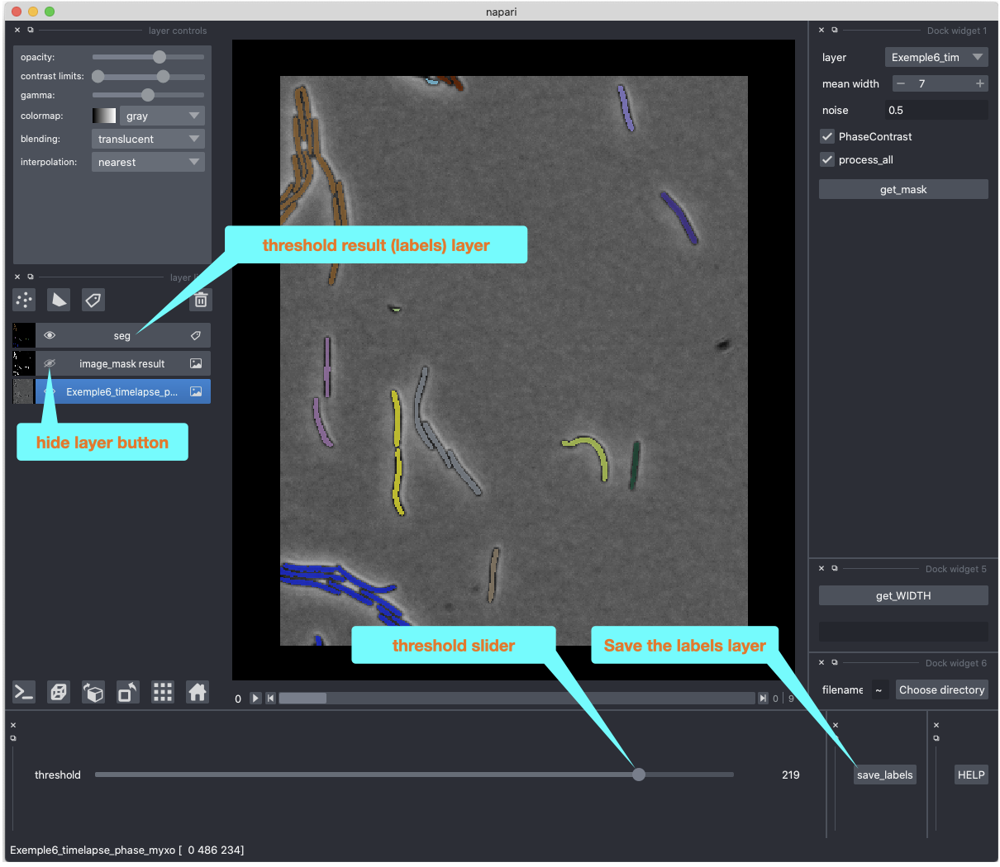

MiSiC & MiSiCgui Handbook
=========================

# 1 - Introduction 


MiSiC is a tool that allows to generate a segementation mask from microscopic images of bacteria cells. MiSiC solves the problem of images with a dense population of cells that are not correctly obtained by intensity threshold. Other tools based on supervised learning exists (supersegger, DeepCell, Ilastik, etc.). MiSiC accepts a wide range of bacterial morphologies and microscope modalities such as phase contrast, brightfield and fluorescence. MiSiC is not a quantification tool dedicated to measure the cellular features like area, length, position, etc (some convinient tools for this are MicrobeJ and Oufti). A grphical user interfafe is available 'MiSiCgui" (see bellow point 3). The main advantages of MiSiC are :

- wide purpose pre trained model

- only two parameters to set

Details are decribe in : ("https://www.biorxiv.org/content/10.1101/2020.10.07.328666v1")

## a) Recommended images: size, resolution and cells density

MiSiC is based in a pre-trained convolutional network (CNN). It works for images obtained at high magnification and resolution (> 60x and N.A > 1.25), common CMOS cameras with a photosite size of around 6 µm yield a 60-100nm/pixel resolution. The CNN model was trained with synthetic data with a width of 10 image pixels. This value is in the range of bacteria cells size (≈ 1 µm). The size parameter adjust the size of the source image to be close to the training conditions (see bellow).

## b) Phase Contrast, Brightfield, Fluorescence

These modalities are mostly used in for photonic microscopy. The MiSiC model was trained with a representaion of the image ("Shape Index") independent from the microscope modality, allowing to predict the binary masks from any of these tree kinds of images. MiSiC need to set if there are bright objects in a dark background (Brightfield and fluorescence) or dark objects in a light background (phase contrast)

## c) Pre and post processing

Usually any pre processing step is required. However some low quality images or images with a wide range of intensities (i.e. fluorescence signal with an heterogeneous protein expresion) may yield better results with a pre processing modifacation. For Phase Contrast images usually a slight correction of gamme over 1.0 could increase the contrast of light cells. For fluorescence images a gamma correction close to 0.2 and a Gaussian of Laplacian modifcation could increase the detectivity with MiSiC (see below) :


## d) Parameters : size and noise

# 2 - MiSiC
## a) Installation
Requires version python version 3.6

`pip install git+https://github.com/pswapnesh/MiSIC.git`

or 

`pip install https://github.com/pswapnesh/MiSiC/archive/master.zip`


## b) Usage
### command line
`mbnet --light_background True --mean_width 8 --src '/path/to/source/folder/\*.tif' --dst '/path/to/destination/folder/'`

`mbnet -lb True -mw 8 -s /path/to/source/folder/*.tif -d /path/to/destination/folder/`

### use package
```python
from MiSiC.MiSiC import *
from skimage.io import imsave,imread

filename = 'awesome_image.tif'

# read image using your favorite package
im = imread(filename)

# Parameters that need to be changed
## Ideally, use a single image to fine tune two parameters : mean_width and noise_variance (optional)

#input the approximate mean width of microbe under consideration
mean_width = 8
noise_variance = 0.0001

# compute scaling factor
scale = (10/mean_width)

# Initialize MiSiC
misic = MiSiC()

# preprocess using inbuit function or if you are feeling lucky use your own preprocessing
im = pre_processing(im,scale = scale, noise_var = noise_variance)

# segment the image with invert = True for light backgraound images like Phase contrast
y = misic.segment(im,invert = True)

# if you need both the body y[:,:,0] and contour y[:,:,1] skip the post processing.
y = post_processing(y,im.shape)

# save 8-bit segmented image and use it as you like
imsave('segmented.tif', (y*255).astype(np.uint8))

```

# 3 - MiSiCgui


A GUI for MiSiC tool

Based on MiSiC ("https://github.com/pswapnesh/MiSiC")

Please cite: ("https://www.biorxiv.org/content/10.1101/2020.10.07.328666v1")


## a) Installation
Requires version python version 3.7 install via [pip]:

we strong recommand to create a specific envronement with conda/miniconda (https://docs.conda.io/projects/conda/en/latest/user-guide/install/index.html).

After conda installation open a terminal and :

`conda create --name MiSiCgui git python=3.7`

`conda activate MiSiCgui`

`pip install git+https://github.com/leec13/MiSiCgui.git`

`MISIC`

## b) Troubleshooting

Windows :

Sometimes needs to re-install numpy

`conda activate MiSiCgui`

`conda install numpy`

Mac : 

PyQt5 needs mac os > 10.13 (or manage to install pyqt5 exemple : https://gist.github.com/guillaumevincent/10983814)

Sometimes needs to install Xcode.

or at least the gcc compiler :

`conda activate MiSiCgui`

`conda install clang_osx-64`

`conda install -c anaconda psutil`

(not tested yet)

Linux :

Some linux systems need :

`conda activate MiSiCgui`

`conda install gcc_linux-64`

`sudo apt-get install --reinstall libxcb-xinerama0`

Know bugs : error while quit the application

## c) Usage

### Start the GUI app
type MISIC in the terminal:

```bash
$ conda activate MiSiCgui
$ MISIC
```

## d) 
### How to use it
The Napari site explain how to use the interface, please see :

("https://napari.org/tutorials/")

The images folder contains some images exemples and the resulting masks with the parameters used in the file name.

Specific commands for MISICgui (respect the order)

1 - Drag and drop one images

2 - Select a default directory

Measure roughtly the mean width of cell (steps 2, 3, 4 in the screenshot bellow)

5 - Set the mean width with the upper right button

6 - click "get_mask" button

To process all slides of one stack slect "process all"

The screenshots bellow explain each step :







