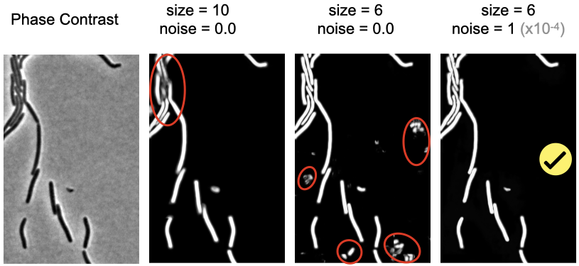

MiSiC & MiSiCgui Handbook
=========================

# 1 - Introduction 


MiSiC is a tool that allows generating a segmentation mask from microscopic images of bacterial cells. MiSiC has the capacity to detect and segment bacterial cells in microcolonies and/or dense images, which is not achievable using intensity thresholds. MiSiC can handle a wide range of bacterial morphologies and microscope modalities such as phase contrast, brightfield and fluorescence. MiSiC functions upstream of specialised tools for bacterial cell biology dedicated to measuring cellular features like area, length, position, etc (some convenient tools for this are MicrobeJ and Oufti). A graphical user interface named 'MiSiCgui"is available  (see below point 3). The main advantages of MiSiC are :

- Provide a pre-trained model with general detection capacities under various imaging modalities

- Provide an easy parameter handling with a graphical user interface


## a) Recommended images: size, resolution and cells density

MiSiC is based ona pre-trained convolutional network (CNN). It works for images obtained at high magnification and resolution (> 60x and N.A > 1.25), common CMOS cameras with a photosite size of around 6 µm yield a 60-100nm/pixel resolution. The CNN model was trained with synthetic cell shapes with a width of 10 pixels. This value was chosen to match the average width of bacterial cells observed at this resolution (1 µm). Therefore, the size parameter  is meant to adjust the size of the source image to the size of the objects used to train the model (see below).

## b) Phase Contrast, Brightfield, Fluorescence

The MiSiC model was trained with a representation of the image ("Shape Index") to obtain binary masks from any three imaging modalities, phase contrast, bright-field and fluorescence.  MiSiC only needs to be set to detect bright objects in a dark background (Brightfield and fluorescence) or dark objects in a light background (phase contrast)

## c) Pre-processing


In most cases, pre-processing is not required. However some low quality images or images with a wide range of intensities (i.e. fluorescence signal with an heterogeneous protein expression) may yield better results with a pre-processing modification.

**Recommendations and thumb rules.** In general, the main objectives of a preprocessing pipeline will be to:
homogenize contrast such that it is almost similar between cells. 
improve the definition of the edges between bacteria. 

We have identified that procedures such as “gamma adjustment”, sharpening with “unsharp mask” and “gaussian laplace edge detection” may be used to enhance the MiSiC segmentation outputs, individually or in combination. A few recommendations for preprocessing are mentioned below:

Phase Contrast:\
Gaussian of laplace (sigma = 2)

Fluorescence:\
Gamma correction (0.2-0.5)\
Unsharp mask (radius = 1, amount = 2)\
(optional) Gaussian of laplace (sigma = 2)

In fluorescence images, depending on the probe (ie a fluorescent genetic reporter protein), it is frequent that variable intensities are observed between cells. This leads to false negatives where the cells are faint. In this case gamma correction and a Gaussian of laplace help homogenise cell intensities. Unsharp mask provides a higher definition at the edges. 
These procedures improve the MiSiC mask as shown below:


*(100X NA 1.43 microscope objective, 0.067 µm/pixel; gamma correction = 0.25 ; Laplacian filter ; Gaussian filter r = 2 px)*


## d) Parameters : size and noise

**Size.** The CNN model was trained with synthetic cell shapes with a 10 pixels width. This value was chosen to match the average pixel width of bacterial cells (which typically varies between 0.5-1 µm) observed at typical resolutions (see a). Therefore, the size parameter is meant to scale the size of the source image to the size of the objects used to train the model. We show how it can be adjusted in the GUI below.
**Noise.** Noise can be added to prevent false detection of non-cell objects to the scaling procedure. Noise can be tuned from a scale of 0 to 10 (x10<sup>-4</sup>) in the GUI (see below).
Example of mask optimization using the size and noise parameters:




## e) Post-processing.

MiSiCgui (see below) saves the probability map as an 8 bits image that can be thresholded for semantic cell recognition and saved a 32 bits labeled mask. Post processing depends on desired application. In dense regions, when not fully resolved cell separation and septa can be improved by applying algorithms on the mask such as watershed or even supersegger. Cells may also be filtered by available softwares such as MicrobeJ and Oufti. 

For example, watershed methods may be used to obtain a more accurate segmentation that aligns with cell boundaries or to well-separated cells when needed.
An example algorithm is illustrated in the following pseudo-code:

````
============================================
# valid pixels with probability > 0.4
mask = body_prediction > 0.4 

# the watershed potential. This could be original image or processed image # that enhanced edge.
watershed_potential = original_image

# the unique markers at each cell. Thus, only pixels with high probability # are picked
watershed_markers = connected_components(body_prediction>0.95)

# segmentation using watershed
segmented_image = watershed_method(potential = watershed_potential,markers    = watershed_markers, mask = mask) 
============================================
````


# 2 - MiSiC package

Based on MiSiC ("https://github.com/pswapnesh/MiSiC")

## a) Installation
Requires version python version 3.6/7

`pip install misic`


## Usage

### use package
```python
from misic.misic import *
from misic.extras import *
from skimage.io import imsave,imread
from skimage.transform import resize,rescale

filename = 'awesome_image.tif'

# read image using your favorite package
im = imread(filename)

sr,sc = im.shape

# Parameters that need to be changed
## Ideally, use a single image to fine tune two parameters : mean_width and noise_variance (optional)

#input the approximate mean width of microbe under consideration
mean_width = 8

# compute scaling factor
scale = (10/mean_width)

# Initialize MiSiC
mseg = MiSiC()

# preprocess using inbuit function or if you are feeling lucky use your own preprocessing
im = rescale(im,scale,preserve_range = True)

# add local noise
img = add_noise(im,sensitivity = 0.13,invert = True)

# segment
yp = mseg.segment(img,invert = True)
yp = resize(yp,(sr,sc))

# body = resize(yp[:,:,0],[sr,sc])
# contours = resize(yp[:,:,1],[sr,sc])

# watershed based post processing (optional)
yp = postprocess_ws(img,yp)

# save 8-bit segmented image and use it as you like
imsave('segmented.tif', yp.astype(np.uint8))
''''

### In case of gpu error, one might need to disabple gpu before importing MiSiC [ os.environ["CUDA_VISIBLE_DEVICES"]="-1" ]
```

# 3 - MiSiCgui

A Graphic User Interface (GUI) for MiSiC

## a) Installation

Requires version python version 3.7 install via [pip]:
We strongly recommend creating a specific environment with conda/miniconda (https://docs.conda.io/projects/conda/en/latest/user-guide/install/index.html).

After conda installation open a terminal and :

`conda create --name MiSiCgui git python=3.7`

`conda activate MiSiCgui`

`pip install git+https://github.com/leec13/MiSiCgui.git`

`MISIC`

## b) Troubleshooting

In some cases it will necessary to remove the old environments of MiSiC and MiSiCgui and force pip install to re-install the package : 

`pip install --upgrade --force-reinstall git+https://github.com/leec13/MiSiCgui.git`

Windows :

Sometimes you will need to re-install numpy

`conda activate MiSiCgui`

`conda install numpy`

Mac : 

Big Sur creates an issue with OpenGL (https://github.com/python/cpython/pull/21241). Maybe it could be fix with this recipes : https://stackoverflow.com/questions/66424295/pyopengl-installation-on-macos-big-sur https://stackoverflow.com/questions/63475461/unable-to-import-opengl-gl-in-python-on-macos

PyQt5 needs mac os > 10.13 (or manage to install pyqt5 example : https://gist.github.com/guillaumevincent/10983814)

Sometimes you will need to install Xcode.

or at least the gcc compiler :

`conda activate MiSiCgui`

`conda install clang_osx-64`

`conda install -c anaconda psutil`

(not tested yet)

Linux :

Some linux systems need :

`conda activate MiSiCgui`

`conda install gcc_linux-64`

`sudo apt-get install --reinstall libxcb-xinerama0`

Know bugs : error while quit the application

## c) Usage

### Start the GUI app
type MISIC in the terminal:

```bash
$ conda activate MiSiCgui
$ MISIC
```

## d) 
### How to use it
The Napari site explain how to use the interface, please see :

("https://napari.org/tutorials/")

The images folder contains some images exemples and the resulting masks with the parameters used in the file name.

Specific commands for MISICgui (respect the order)

1 - Drag and drop one images

2 - Select a default directory

3 - Measure roughly the mean width of cell (steps 2, 3, 4 in the screenshot below)

5 - Set the mean width with the upper right button

6 - click "get_mask" button

This tool works also in "tif stacks" (multiples images in a single Tif file). To process all slides of one stack select "process all", all the slides will be processed with the current settings for width and noise. It means that you have to test some different values in different slices of the stack in order to obtain the better compromize.

Saving outputs :

Each time the "get_mask" button is used the corresponding segmented image is automatically saved to the default output directory, or to the user's home directory.
The filename will include the source image name and the settings for width and noise parameters.
If you set a threshold value with the threshold slider to obtain a labels layer (called "seg"), you have to save it by yourself with the button "save labels" in the bottom right panel

The screenshots below explain each step :

### First step, determine a starting value for the mean width parameter


### Generate a mask for the current slide or for the whole time lapse stack


### Generate a threshold image labeled (works also for stacks)


